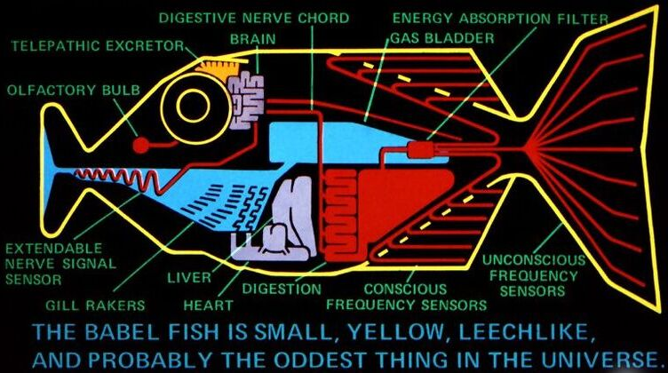
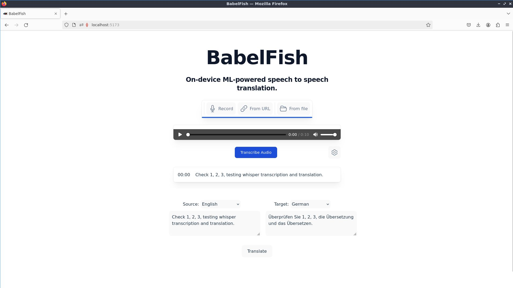
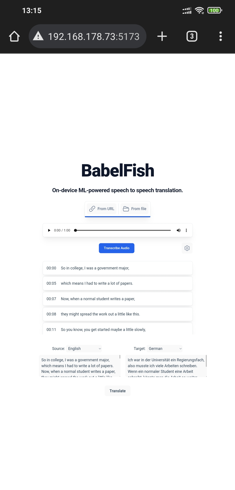

# BabelFish




Real time speech2speech language translation directly in your browser! Built with [🤗 Transformers.js](https://github.com/xenova/transformers.js). 

Using local Whisper, publicly available machine translation models and text2speech models, bundled up in an end to end pipeline.

Check out the demo site [here](https://elegant-phoenix-ffa99e.netlify.app/). Still a work in progress.

Currently working on chaining all the modules together to run more seamlessly, and improving latency.


## Getting Started / Running locally

0. Installation/ Env setup

    Create a new conda environment named babelfish using `conda create -n babelfish nodejs`

    ```
    conda activate babelfish
    ```

    Here, we are using conda to manage the nodejs and npm javascript packages. Use whatever works for you.

1. Clone the repo and install dependencies:

    ```bash
    git clone https://github.com/yojuna/babel_fish.git
    cd babel_fish
    npm install
    ```

2. Run the development server:

    ```bash
    npm run dev
    ```
    > Firefox users need to change the `dom.workers.modules.enabled` setting in `about:config` to `true` to enable Web Workers.
    > Check out [this issue](https://github.com/xenova/whisper-web/issues/8) for more details.

3. Open the link (e.g., [http://localhost:5173/](http://localhost:5173/)) in your browser. Or alternatively, you can open it on your mobile browser at the internal IP address of your wifi network. Refer to the command line output after running `npm run dev`

This is how it currently looks like when running locally in your browser

Desktop view:


On mobile:

Note: For running on mobile locally, chrome/firefox security disables audio recording permissions for local self-signed/selh-hosted sites. Workaround for HTTPS setup for local mobile devices on the same network to be added soon. Work in progress. Currently trying to use Caddy V2 to setup the local https enabled server for hosting the app on the same network.

## Dev Log

TODOs

- [DONE] add whisper transcription module

- [DONE] translation of transcribed audio (from whisper)

- [] speech generation in targer language from translated text

- [] real time audio transcription without user prompting (transcribes the stream of audio input continuously). Needed for uninterrupted usage to achieve real-time transcription.

- [] Select audio mic device (phone main mic, or connected bluetooth earphone device mic) from drop down, to use as the speech audio input. Later, to initialize with the connected earphone mic by default.
    - in progress ...

- [] set audio output device (set to connected earphones)

- [] chunking/bundling the transcription pipeline:
    - :: speech recognition in source language -> translation -> speech generation in target language

- [] user/client app connectivity with other user,
    - user1 speaks in source lang; user2 hears in target language
        - eg. user1 speaks (english) <--> user2 hears (german)
    - vice versa to complete the loop,
        - i.e user2 speaks (german) <--> user1 hears (english)

- [] app clients p2p connection over network (initially over local wifi) (using websockets/webrtc; similar to snapdrop app like interface)

- [] models switching functionality:
    - switch out the base models being used for other available models (optional)

- [] ui/ux optimized for mobile
    - PWA with local install capability
    - resource usage stats (optional)

### useful links/references

- [Transformers.js pipeline API](https://huggingface.co/docs/transformers.js/en/pipelines)
    - [React tutorial/guide](https://huggingface.co/docs/transformers.js/en/tutorials/react)
- [web.dev: Recording Audio from the User](https://web.dev/articles/media-recording-audio)
- [whisper-web repository](https://github.com/xenova/whisper-web)
- [useWhisper React Hook](https://github.com/chengsokdara/use-whisper)
- [German Speech recognition models - huggingface collection](https://huggingface.co/collections/flozi00/german-speech-recognition-654b565d4d9e2a79f4fca073)
- German text to speech models:
    - [Massively Multilingual Speech (MMS): German, Standard Text-to-Speech ](https://huggingface.co/facebook/mms-tts-deu)

- [hf - seamless streaming](https://huggingface.co/facebook/seamless-streaming)

## Credits

Heavily inspired by and built/modified upon
- [🤗 Transformers.js](https://github.com/xenova/transformers.js) (whisper-web [demo](https://github.com/xenova/whisper-web)) 
- [Snapdrop](https://github.com/RobinLinus/snapdrop): local file sharing in your browser.
- All the beautiful, publicly available Open Source models from Huggingface <3
    - citations/sources/links to be updated soon.